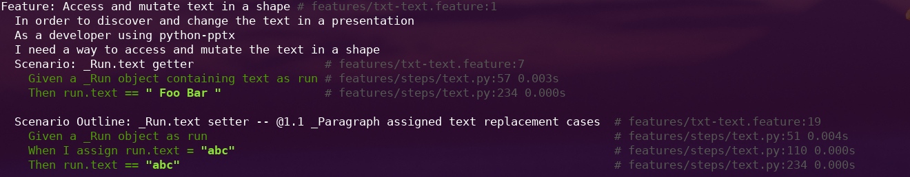
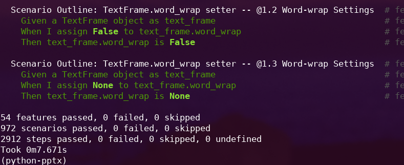

# A quick look into BDD

How ETS can benefit from BDD


<br />

_27 September 2021_
<br />
<tfoot align="left"> Mingyao Lin, Technology Project </tfoot>

---

## What is BDD

BDD is the successor to TDD. BDD is Driven by business value.
It achieves this through focusing on the user interface to the application which is where business interactions and behaviours are captured.

Each piece of code, starting with the UI, can be considered a stakeholder of the other modules of code which it uses. Each element of code provides some aspect of behavior which, in collaboration with the other elements, provides the application behavior.

---

## Situation

- The BAs who are writing user stories are not close to Devs
- There will be dissonance between user stories and interpretation from coders
- It is unclear what agile framework is being used to build out the test case suite

---

## Opportunity

If we make the right decisions now we could make life easier for everyone

---

## What we don't want

- Incomplete understanding of the User stories by the Devs
- Unclear understanding of completeness across the team
- Limited logical mapping between automated testing, code, features and user stories

---

## Complications

- We have little time
- The key people are busy doing setup or producing to make sure we are ready for the Build Phase
<br>  </br>
_It is always good to check we are doing the right things versus only being busy on the upcoming things_

---
## Opportunity

- Excellent free agile methodologies and tooling is available to solve our problems.

- BDD tooling exists to remove the dissonance between business documentation and dev code and testing

<section style="text-align: center;">

<br></br>
<br>  </br>
<br></br>
<br>  </br>
We reduce risk on our largest upcoming communication friction

---
## Implication

_If we take the right actions now we will find our rhythm faster and be better managed going forward_


---
## Suggested next steps

1. Have Penny, one Dev and one BA spend two hours each of their time to look into BDD
1. Have the three members come back as a group to discuss what they found out and if they want to recommend BDD
1. Come back to the group with their recommendation

---

## BDD examples

---

## Business analysts write features, scenarios and steps
Written in simple natural language with a few simple rules

```gherkin
Feature: showing off behave

  Scenario: run a simple test
     Given we have behave installed
      When we implement a test
      Then behave will test it for us!
```

These Feature files are used for documentation and automated tests.

_The above provides generated scaffolding for the Dev BDD tests_
---
## What do Devs do
Devs use the generated scaffolding to build out a test(s) for each of the steps where it makes sense


---

### Resulting in automated testing with good mapping





---

### References

If you need a reminder or a first look at BDD, check out the following links

- [A python tutorial from the BDD _behave_ library](https://behave.readthedocs.io/en/stable/tutorial.html)
- [Dan North's 2003 origination post for BDD](https://dannorth.net/introducing-bdd/)
- [BDD Explanation page](https://behave.readthedocs.io/en/stable/philosophy.html)
- [Differences between BDD & TDD](https://cucumber.io/blog/bdd/bdd-vs-tdd/)
- [TDD, BDD and ATDD](https://www.browserstack.com/guide/tdd-vs-bdd-vs-atdd)

---

# Thanks for reading

_Feel free to provide feedback on this presentation to_

_mingyao.lin@mpi.govt.nz_
